# Запуск

На компьютер, где вы будете запускать скрипт, нужно будет установить определенное ПО для более удобного запуска, и зарегистрироваться в сервисе для разгадывания капч..

1) Сервис для капч:   https://rucaptcha.com/ 
     
    Там нужно будет взять API_ключ выглядит так: 
    f0afda4569c81b02a189632еуe6f2c56

    Находится в разделе **"Распознавание"**
    

2) Скачать и установить: https://code.visualstudio.com/

    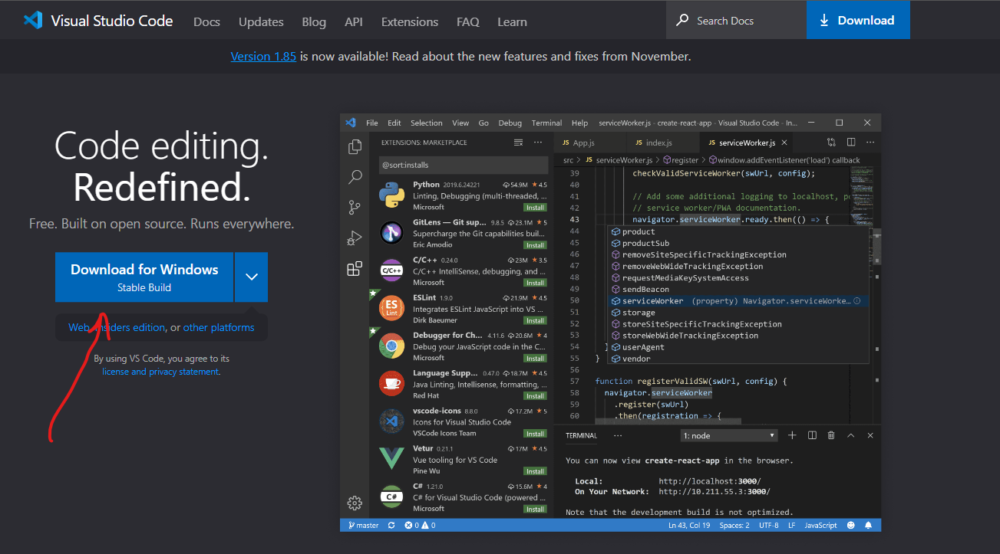

3) После установки нужно открыть VisualStudio и установить дополнительный плагин Python

    Для этого открываете вкладку на которуюуказывает стрелочка:

    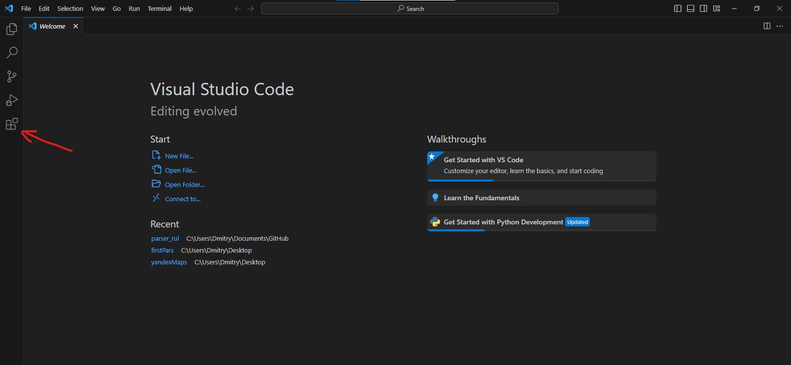

    После этого в поиске вбиваете Python и нажимаетесинюю кнопочку Install (на скрине нет кнопочки потому что он у меня уже установлен):

    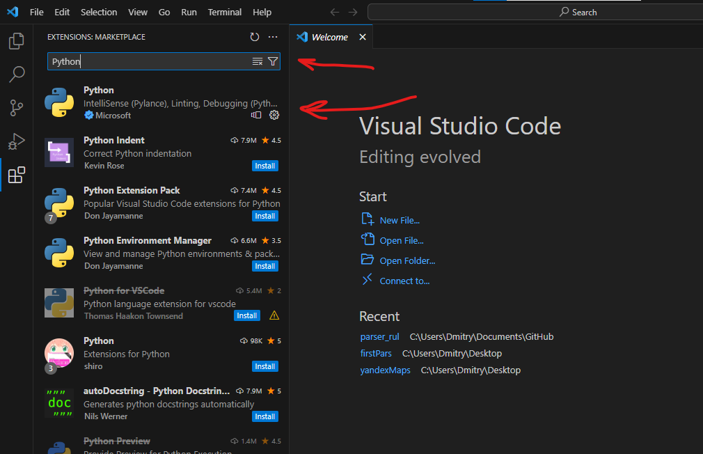

4) Следующим шагом открываете через эту программу папку, которую я вам скинул (после нажатия на синюю кнопку выбираете папку на своем компьютере):

    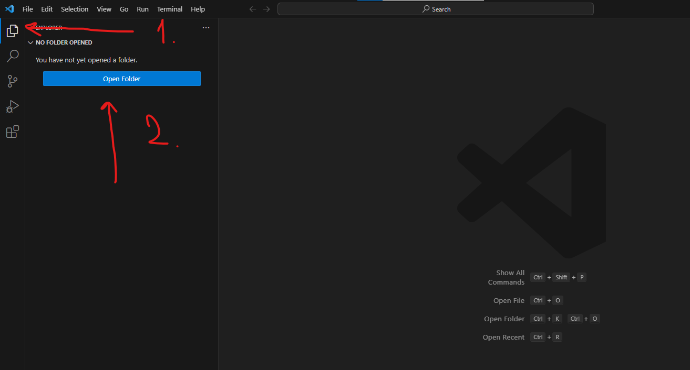

5) После открытия появятся файлы:

    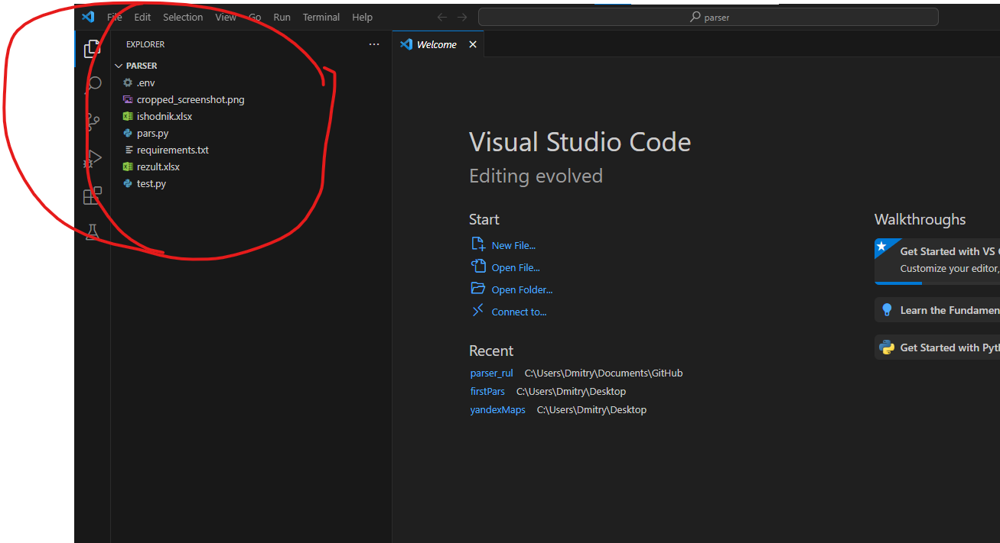

6) Далее нужно установить нужные библиотеки для запуска программы:

    Кликаете на кнопочку Terminal и выбираете New terminal:
    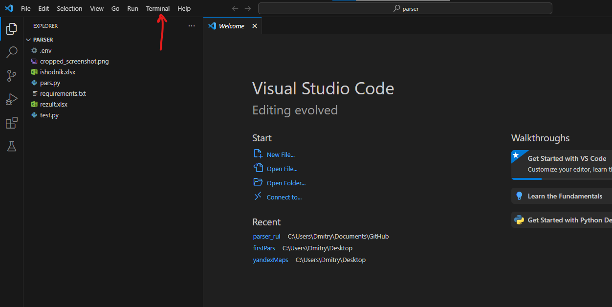

7) Снизу появится терминал для ввода команд. Нужно ввести команду: `pip install -r requirements.txt`

    Загрузятся все необходимые библиотеки.

8) Далее загружаете в папку ваш исходный файл (назовите его **ishodnik**) формат обязательно **.xlsx**

9) Потом нужно открыть файл **.env** и в ковычки вставить ваш API_ключ для разгадывания капч.

    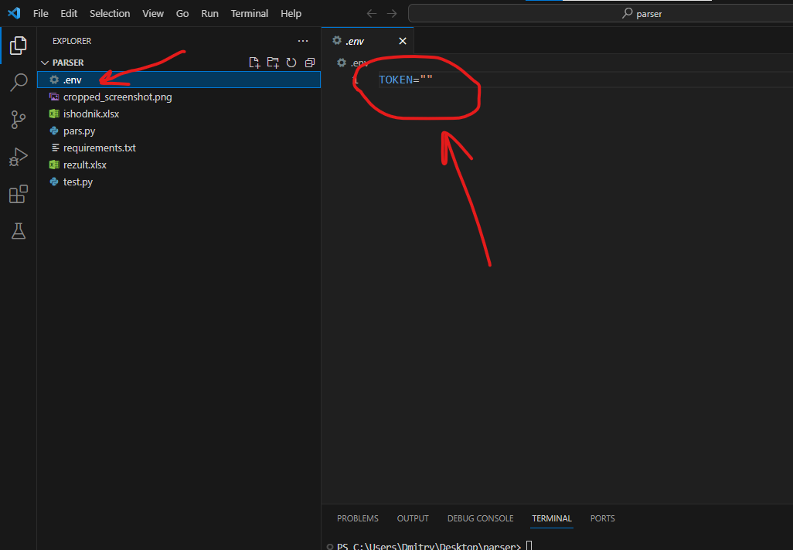

10) После этого откываете основной файл с кодом **pars.py**

    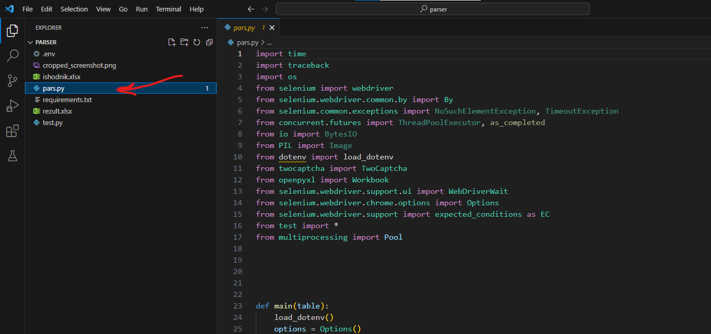

11) Нажимаете на кнопку запуска.

    На треугольник

    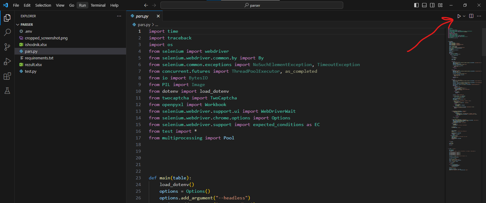

    После чего программа в терминале попросит указать количество процессов для запуска. Попробуйте указать 10 и нажать Enter. В терминале должна начаться работа:

    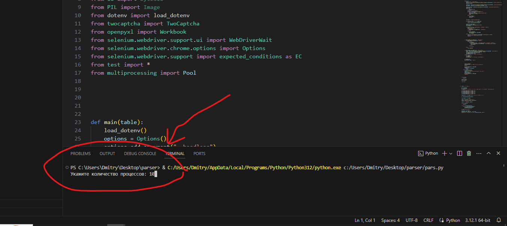

    После завершения в папке появится файл **rezult.xlsx** это как раз готовый файл.

    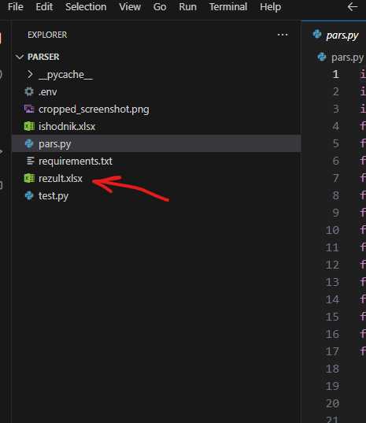

    Внутри выглядит так:
    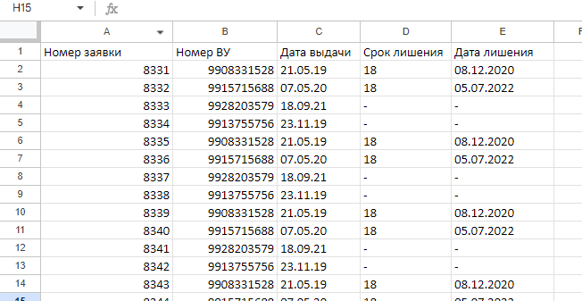